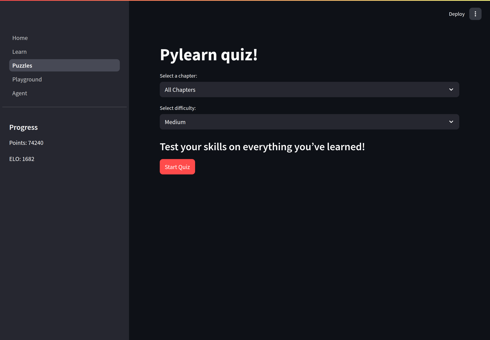

# Pylearn

A basic Python learning app built with Streamlit. It also includes an AI agent that interacts with various features.  
Collaboration with [Konstantinos10](https://github.com/Konstantinos10) and [WalkingParado](https://github.com/WalkingParado).

## Screenshots

### Login page

### Home page

### Learn page

### Learn example

### Puzzles page

### Puzzles example 1

### Puzzles example 2 (right answer)

### Puzzles example 3 (wrong answer)

### Playground page

### Agent page 1

### Agent page 2

### Agent page 3

For now, this repo serves as an archive. More information about the project and instructions on how to run it will be added later.